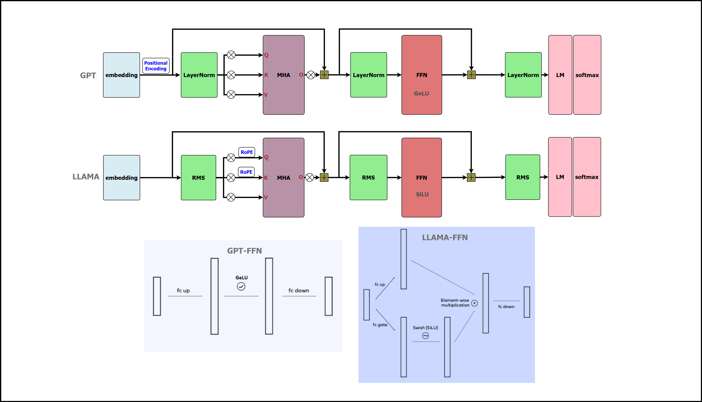
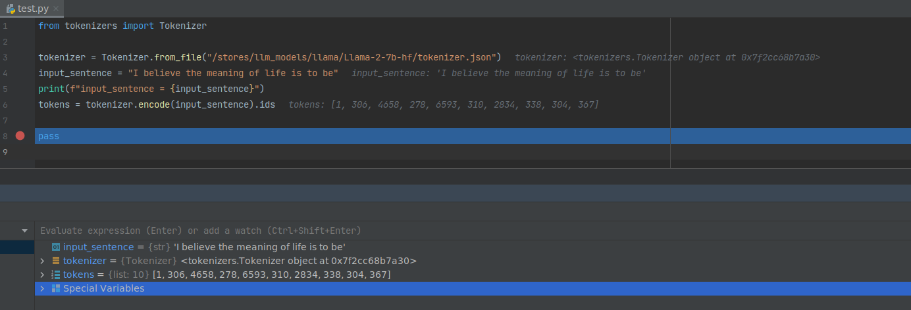
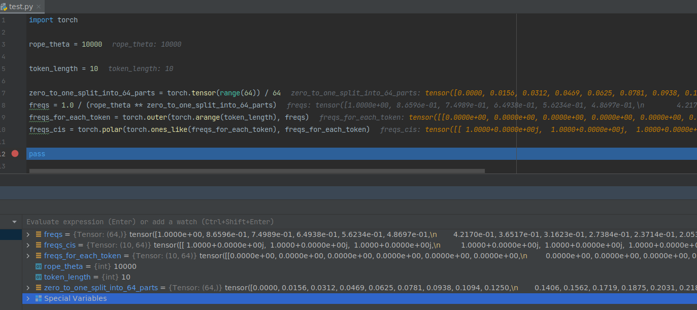
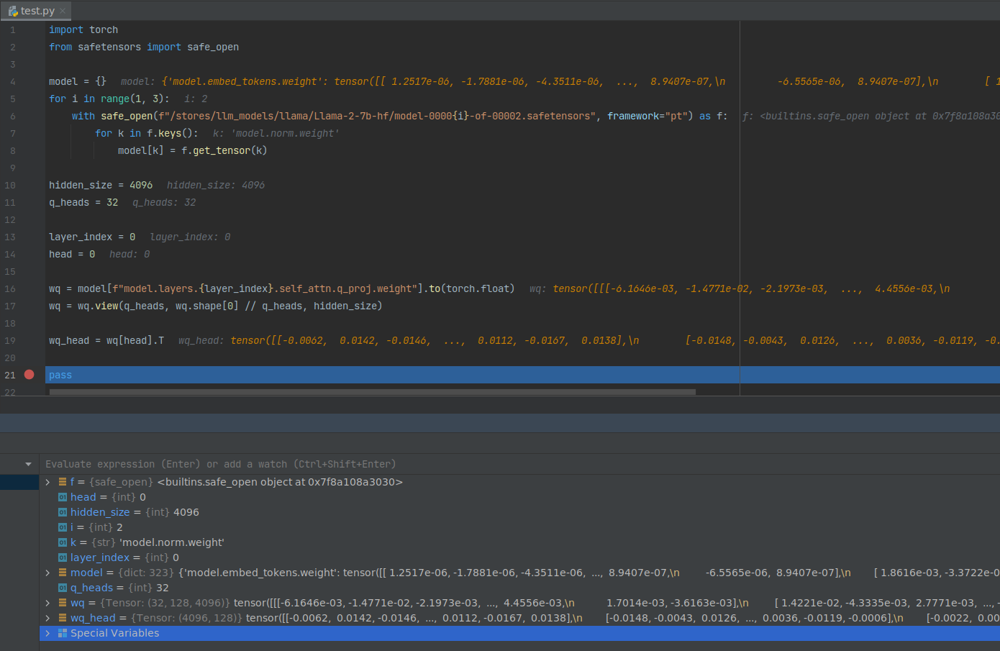
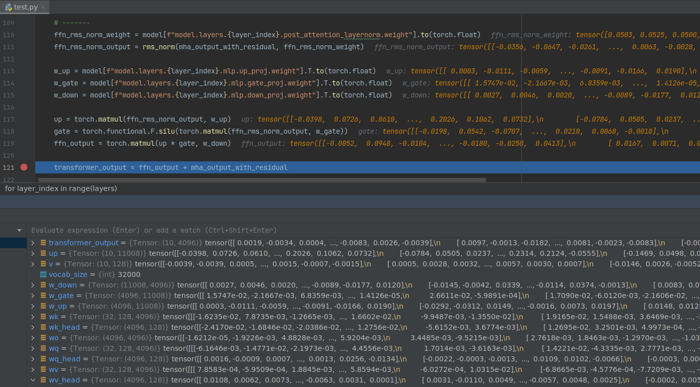

***

# 1. Introduction

official LLaMA model definition can be find in https://github.com/meta-llama/llama.

this part will introduce structure of **LLaMA2-7B** model and also the links to download model weight.

***

### 1.1 model structure.



***


***

### 1.2 download model.

| site       | download link                                            |
|------------|----------------------------------------------------------|
| modelscope | https://www.modelscope.cn/models/shakechen/Llama-2-7b-hf |

from above site you can download model weight for inference.

***

### 1.3 model parameters.

```python
from safetensors import safe_open

safetensors = 2
for i in range(1, safetensors + 1):
    safetensor = "/stores/llm_models/llama/Llama-2-7b-hf/model-000%02d-of-000%02d.safetensors" % (i, safetensors)
    with safe_open(safetensor, framework="pt") as f:
        for k in f.keys():
            print(k)
```

    model.embed_model.embed_tokens.weight
    ...
    model.layers.0.input_layernorm.weight
    model.layers.0.self_attn.q_proj.weight
    model.layers.0.self_attn.k_proj.weight
    model.layers.0.self_attn.v_proj.weight
    model.layers.0.self_attn.o_proj.weight
    model.layers.0.post_attention_layernorm.weight
    model.layers.0.mlp.up_proj.weight
    model.layers.0.mlp.gate_proj.weight
    model.layers.0.mlp.down_proj.weight
    ...
    model.layers.31.input_layernorm.weight
    model.layers.31.self_attn.q_proj.weight
    model.layers.31.self_attn.k_proj.weight
    model.layers.31.self_attn.v_proj.weight
    model.layers.31.self_attn.o_proj.weight
    model.layers.31.post_attention_layernorm.weight
    model.layers.31.mlp.up_proj.weight
    model.layers.31.mlp.gate_proj.weight
    model.layers.31.mlp.down_proj.weight
    ...
    model.norm.weight
    lm_head.weight

you can find there are **32** layers for LLaMA2-7B weight.

| weight name                                    | usage |
|------------------------------------------------|-------|
| model.embed_model.embed_tokens.weight          | EMB   |
| model.layers.*.input_layernorm.weight          | RMS   |
| model.layers.*.self_attn.q_proj.weight         | MHA   |
| model.layers.*.self_attn.k_proj.weight         | MHA   |
| model.layers.*.self_attn.v_proj.weight         | MHA   |
| model.layers.*.self_attn.o_proj.weight         | MHA   |
| model.layers.*.post_attention_layernorm.weight | RMS   |
| model.layers.*.mlp.up_proj.weight              | FFN   |
| model.layers.*.mlp.gate_proj.weight            | FFN   |
| model.layers.*.mlp.down_proj.weight            | FFN   |
| model.norm.weight                              | RMS   |
| lm_head.weight                                 | LM    |

llama2's original weight dtype is **bfloat16**, it was converted to **float16** as **HF** format. using **float32** here
for demo on **CPU**.

***

# 2. Operators.

this part will introduce operators that used in LLaMA2-7B model.

***

### 2.1 tokenizer.

```python
from tokenizers import Tokenizer

tokenizer = Tokenizer.from_file("/stores/llm_models/llama/Llama-2-7b-hf/tokenizer.json")
input_sentence = "I believe the meaning of life is to be"
print(f"input_sentence = {input_sentence}")
tokens = tokenizer.encode(input_sentence).ids

pass
```



The LLaMA tokenizer is a **BPE** model based on **sentencepiece**.

***

### 2.2 embedding.

```python
import torch

dim = 4096
vocab_size = 32000

model = torch.load("/stores/llm_models/llama/Llama-2-7b/consolidated.00.pth")

embedding_layer = torch.nn.Embedding(vocab_size, dim)
embedding_layer.weight.data.copy_(model["tok_embeddings.weight"])
```


***

### 2.3 RMS (Root Mean Square Normalization).


```python
import torch
from safetensors import safe_open

norm_eps = 1e-05


def rms_norm(x, norm_weights):
    return (x * torch.rsqrt(x.pow(2).mean(-1, keepdim=True) + torch.tensor(norm_eps))) * norm_weights


model = {}
for i in range(1, 3):
    with safe_open(f"/stores/llm_models/llama/Llama-2-7b-hf/model-0000{i}-of-00002.safetensors", framework="pt") as f:
        for k in f.keys():
            model[k] = f.get_tensor(k)
norm_weights = model[f"model.layers.0.input_layernorm.weight"].to(torch.float)
x = torch.rand((3, 4096))
y = rms_norm(x, norm_weights)

print(x)
print(y)

pass
```


you can see **model.layers.*.input_layernorm.weight** is the weight of γ (gamma) in RMS formula.

***

### 2.4 RoPE (Rotary Position Embedding).


above picture shows how RoPE embed position info into Q and K.

***

##### freqs_cis

```python
import torch

rope_theta = 10000

token_length = 10

zero_to_one_split_into_64_parts = torch.tensor(range(64)) / 64
freqs = 1.0 / (rope_theta ** zero_to_one_split_into_64_parts)
freqs_for_each_token = torch.outer(torch.arange(token_length), freqs)
freqs_cis = torch.polar(torch.ones_like(freqs_for_each_token), freqs_for_each_token)

pass
```



you can see the size of freqs_cis is **(10, 64)**.

***

##### freqs_cis one row plot image.

```python
import torch
from matplotlib import pyplot as plt

rope_theta = 10000

token_length = 10

zero_to_one_split_into_64_parts = torch.tensor(range(64)) / 64
freqs = 1.0 / (rope_theta ** zero_to_one_split_into_64_parts)
freqs_for_each_token = torch.outer(torch.arange(token_length), freqs)
freqs_cis = torch.polar(torch.ones_like(freqs_for_each_token), freqs_for_each_token)

value = freqs_cis[3]
plt.figure()
for i, element in enumerate(value):
    plt.plot([0, element.real], [0, element.imag], color='blue', linewidth=1, label=f"Index: {i}")
    plt.annotate(f"{i}", xy=(element.real, element.imag), color='red')
plt.xlabel('Real')
plt.ylabel('Imaginary')
plt.title('freqs_cis (one row)')
plt.show()

pass
```


***

### 2.5 MHA (Multi-Headed Attention).

***

##### weight of q

```python
import torch
from safetensors import safe_open

model = {}
for i in range(1, 3):
    with safe_open(f"/stores/llm_models/llama/Llama-2-7b-hf/model-0000{i}-of-00002.safetensors", framework="pt") as f:
        for k in f.keys():
            model[k] = f.get_tensor(k)

hidden_size = 4096
q_heads = 32

layer_index = 0
head = 0

wq = model[f"model.layers.{layer_index}.self_attn.q_proj.weight"].to(torch.float)
wq = wq.view(q_heads, wq.shape[0] // q_heads, hidden_size)

wq_head = wq[head].T

pass
```



from above picture you can see **layers.0.attention.wq.weight** is split into 32 parts.

| tensor name   | size            |
|---------------|-----------------|
| q_proj.weight | (4096, 4096)    |
| wq            | (32, 128, 4096) |
| wq_head       | ( 4096, 128)    |

due to q_proj.weight is (column, row) matrix, so first split on column dim and then transpose it.

***

##### q per head.


| tensor name         | size        |
|---------------------|-------------|
| mha_rms_norm_output | (10, 4096)  |
| wq_head             | (4096, 128) |
| q                   | (10, 128)   |

***

##### mask


    tensor([[0., -inf, -inf, -inf, -inf, -inf, -inf, -inf, -inf, -inf],
            [0., 0., -inf, -inf, -inf, -inf, -inf, -inf, -inf, -inf],
            [0., 0., 0., -inf, -inf, -inf, -inf, -inf, -inf, -inf],
            [0., 0., 0., 0., -inf, -inf, -inf, -inf, -inf, -inf],
            [0., 0., 0., 0., 0., -inf, -inf, -inf, -inf, -inf],
            [0., 0., 0., 0., 0., 0., -inf, -inf, -inf, -inf],
            [0., 0., 0., 0., 0., 0., 0., -inf, -inf, -inf],
            [0., 0., 0., 0., 0., 0., 0., 0., -inf, -inf],
            [0., 0., 0., 0., 0., 0., 0., 0., 0., -inf],
            [0., 0., 0., 0., 0., 0., 0., 0., 0., 0.]])

from above picture you can see the size of mask is (10, 10).

***

### 2.6 FFN (Feed Forward Network).




| operator name | weight name   |
|---------------|---------------|
| w_up          | (4096, 11008) |
| w_gate        | (4096, 11008) |
| w_down        | (11008, 4096) |

***

### 2.7 LM head.


only need to get last row of **output_rms_norm**.

***

# 3. Inference code.

this part shows the python code of LLaMA2-7B inference.

```python
import torch
from safetensors import safe_open
from tokenizers import Tokenizer

# ----------------------------------------------------------------------------------------------------------------------
# llama2 7b parameters.
hidden_size = 4096
q_heads = 32
kv_heads = 32
kv_head_size = q_heads // kv_heads
norm_eps = 1e-05
rope_theta = 10000
vocab_size = 32000
layers = 32

# ----------------------------------------------------------------------------------------------------------------------
tokenizer = Tokenizer.from_file("/stores/llm_models/llama/Llama-2-7b-hf/tokenizer.json")
model = {}
for i in range(1, 3):
    with safe_open(f"/stores/llm_models/llama/Llama-2-7b-hf/model-0000{i}-of-00002.safetensors", framework="pt") as f:
        for k in f.keys():
            model[k] = f.get_tensor(k)

# ----------------------------------------------------------------------------------------------------------------------
# input.
input_sentence = "I believe the meaning of life is to be"
print(f"input_sentence = {input_sentence}")
tokens = tokenizer.encode(input_sentence).ids
tokens = torch.tensor(tokens)

# embedding.
embedding = torch.nn.Embedding(vocab_size, hidden_size, dtype=torch.float)
embedding.weight.data.copy_(model["model.embed_tokens.weight"].to(torch.float))
embedding_output = embedding(tokens)


# rms_norm.
def rms_norm(x, norm_weights):
    return (x * torch.rsqrt(x.pow(2).mean(-1, keepdim=True) + torch.tensor(norm_eps))) * norm_weights


# rope.
def rope(x):
    token_length = x.shape[0]
    zero_to_one_split_into_64_parts = torch.tensor(range(64)) / 64
    freqs = 1.0 / (rope_theta ** zero_to_one_split_into_64_parts)
    freqs_for_each_token = torch.outer(torch.arange(token_length), freqs)
    freqs_cis = torch.polar(torch.ones_like(freqs_for_each_token), freqs_for_each_token)
    # rope.
    pairs = x.float().view(x.shape[0], -1, 2)
    complex_numbers = torch.view_as_complex(pairs)
    pairs_rotated = torch.view_as_real(complex_numbers * freqs_cis)
    x_rotated = pairs_rotated.view(x.shape)
    return x_rotated


# --------------------
# transformer layers.
# --------------------
transformer_output = embedding_output
for layer_index in range(layers):
    # -------
    # MHA.
    # -------
    mha_rms_norm_weight = model[f"model.layers.{layer_index}.input_layernorm.weight"].to(torch.float)
    mha_rms_norm_output = rms_norm(transformer_output, mha_rms_norm_weight)

    wq = model[f"model.layers.{layer_index}.self_attn.q_proj.weight"].to(torch.float)
    wk = model[f"model.layers.{layer_index}.self_attn.k_proj.weight"].to(torch.float)
    wv = model[f"model.layers.{layer_index}.self_attn.v_proj.weight"].to(torch.float)

    wq = wq.view(q_heads, wq.shape[0] // q_heads, hidden_size)
    wk = wk.view(kv_heads, wk.shape[0] // kv_heads, hidden_size)
    wv = wv.view(kv_heads, wv.shape[0] // kv_heads, hidden_size)

    qkv_attention_list = []
    for head in range(q_heads):
        wq_head = wq[head].T
        wk_head = wk[head // kv_head_size].T
        wv_head = wv[head // kv_head_size].T

        q = torch.matmul(mha_rms_norm_output, wq_head)
        k = torch.matmul(mha_rms_norm_output, wk_head)
        v = torch.matmul(mha_rms_norm_output, wv_head)

        # rope.
        q_rope = rope(q)
        k_rope = rope(k)

        # dot production attention.
        qk = torch.matmul(q_rope, k_rope.T) / (128 ** 0.5)
        mask = torch.full(qk.shape, float("-inf"))
        mask = torch.triu(mask, diagonal=1)
        qk_masked = qk + mask
        qk_masked_softmax = torch.nn.functional.softmax(qk_masked, dim=1)
        qkv_attention = torch.matmul(qk_masked_softmax, v)

        # append.
        qkv_attention_list.append(qkv_attention)

    qkv_attention_all = torch.cat(qkv_attention_list, dim=-1)

    wo = model[f"model.layers.{layer_index}.self_attn.o_proj.weight"].to(torch.float)
    mha_output = torch.matmul(qkv_attention_all, wo.T)

    mha_output_with_residual = mha_output + transformer_output

    # -------
    # FFN.
    # -------
    ffn_rms_norm_weight = model[f"model.layers.{layer_index}.post_attention_layernorm.weight"].to(torch.float)
    ffn_rms_norm_output = rms_norm(mha_output_with_residual, ffn_rms_norm_weight)

    w_up = model[f"model.layers.{layer_index}.mlp.up_proj.weight"].T.to(torch.float)
    w_gate = model[f"model.layers.{layer_index}.mlp.gate_proj.weight"].T.to(torch.float)
    w_down = model[f"model.layers.{layer_index}.mlp.down_proj.weight"].T.to(torch.float)

    up = torch.matmul(ffn_rms_norm_output, w_up)
    gate = torch.functional.F.silu(torch.matmul(ffn_rms_norm_output, w_gate))
    ffn_output = torch.matmul(up * gate, w_down)

    transformer_output = ffn_output + mha_output_with_residual

# --------------------
# Post Process
# --------------------
output_rms_norm = rms_norm(transformer_output, model["model.norm.weight"]).to(torch.float)
output_logits = torch.matmul(output_rms_norm[-1], model["lm_head.weight"].T.to(torch.float))

# decode last token.
next_token = torch.argmax(output_logits, dim=-1)
next_word = tokenizer.decode([next_token.item()])
print(f"next_word = '{next_word}'")
```

# 4. reference.

https://github.com/meta-llama/llama

https://github.com/naklecha/llama3-from-scratch

https://github.com/wdndev/llama3-from-scratch-zh
